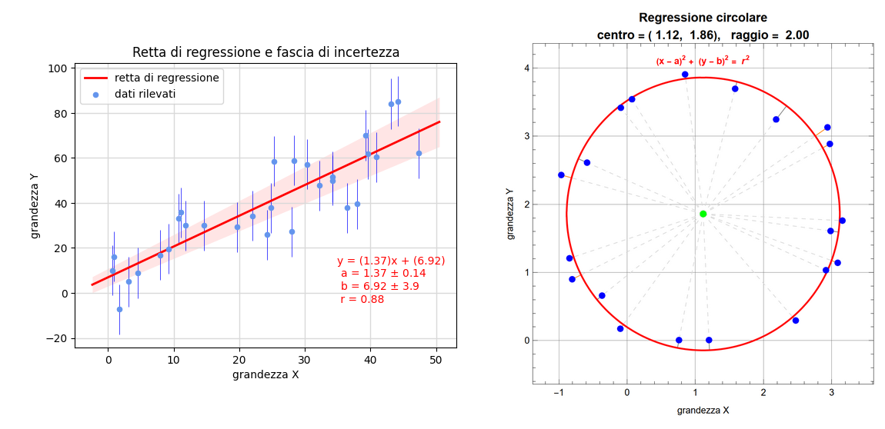

# Regressione lineare e circolare

In questo repository riportiamo i file distribuiti singolarmente nella pagina   [www.lorenzoroi.net/regressione02.html/](https://www.lorenzoroi.net/regressione02.html) e nella quale presentiamo esempi di applicazione della regressione lineare e circolare. Gli stessi file sono qui raccolti in cartelle e distinti per estensione così da agevolarne, eventualmente, il prelievo e la sperimentazione.

In particolare, la cartella

- `ipynb` contiene i notebook di [Jupyter](https://jupiter.org) e i file CSV con i dati sperimentali utilizzati per avviarne l'elaborazione,
- `xlsx` raccoglie i fogli di calcolo Excel/Calc mentre 
- `ggb` riporta i file esemplificativi di [Geogebra](https://www.geogebra.org).

## Consultazione

Nel caso si intenda visualizzare solo il contenuto dei vari notebook `ipynb` (privi dell'output) è sufficiente selezionare il file in questo stesso repository. In alternativa si può avviare *Nbviewer* con il pulsante sottostante

Gli stessi notebook si potranno prelevare e gestire localmente (per es. con l'editor [VSCode](https://code.visualstudio.com/)) selezionandoli dalla cartella [ipynb](https://github.com/lrnzr/regressione/tree/main/ipynb) e quindi, scelta l'opzione `Raw` ed evidenziato (Ctrl+A) tutto il testo mostrato nel browser, questo va copiato (Ctrl+C) e incollato localmente in un nuovo file di testo cui si darà l'estensione `ipynb`. In alternativa, da terminale e nella cartella locale preferita, avviare il comando

`curl -l https://raw.githubusercontent.com/lrnzr/regressione/main/ipynb/NOMEFILE.ipynb > NOMEFILE.ipynb`

sostituendo a `NOMEFILE` il nome del file scelto. 

Per il prelievo dei file `xlsx` e `ggb` selezionare le rispettive cartelle e il file di interesse. Quindi tasto `Download`.

## Sperimentazione

Se invece si vuole sperimentare online in modo interattivo con i notebook va lanciato *Binder*.

Il caricamento sul server di *Binder* dell'intero repository richiede, per poter iniziare l'elaborazione, circa un minuto di attesa dopo il quale ci si trova in un ambiente dove sarà possibile selezionare i vari notebook e avviarne l'esecuzione passo passo oppure, da menu (`Run\Run All Cells`) eseguire in blocco tutte le celle.

*Lorenzo Roi*

